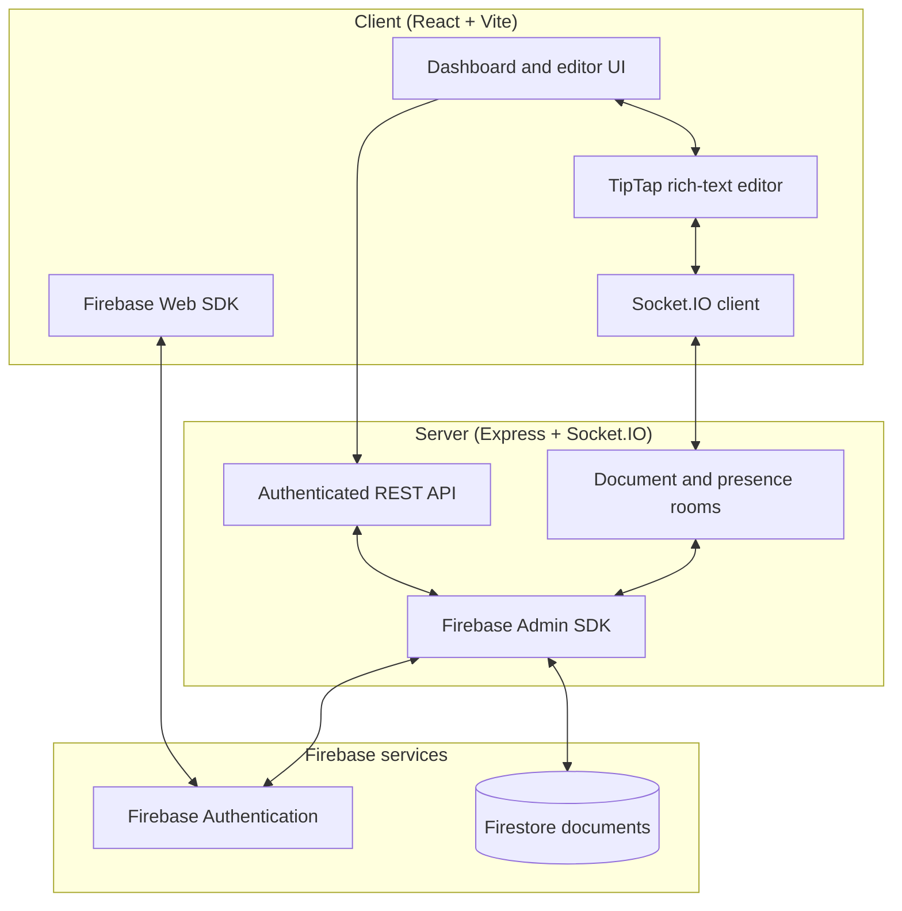

# CanvasLive

CanvasLive is a real-time collaborative document editor built for teams that need to create, edit, and share rich-text documents together. It combines a React workspace with an Express and Socket.IO service for responsive collaboration, live presence, typing indicators, and version history.

---

## Purpose

Traditional document workflows make collaboration slow: contributors work in separate copies, changes are difficult to track, and permissions are often unclear. **CanvasLive** provides a shared workspace where authenticated users can create documents, invite collaborators, and work together in real time.

The project also demonstrates:

- Building a full-stack React and Node.js application with a clear client/server boundary.
- Synchronizing document changes, presence, typing state, and cursors through Socket.IO rooms.
- Enforcing owner, editor, and viewer permissions across REST and real-time operations.
- Preparing a Firebase-backed authentication and Firestore persistence layer for production use.

---

## Tech Stack & Badges

<p align="center">
  <a href="https://react.dev/">
    
  </a>
  <a href="https://vite.dev/">
    
  </a>
  <a href="https://expressjs.com/">
    
  </a>
  <a href="https://socket.io/">
    
  </a>
  <a href="https://firebase.google.com/">
    
  </a>
  <a href="https://tailwindcss.com/">
    
  </a>
</p>

### Technologies Used

| Technology | Role in application |
| :-- | :-- |
| **React 19 + Vite** | Provides the fast, component-based client workspace and development environment. |
| **TipTap** | Powers the rich-text editing experience, including links, text alignment, underline, and placeholders. |
| **Express** | Exposes the authenticated REST API for document, collaborator, and version-management actions. |
| **Socket.IO** | Synchronizes document updates, presence, typing, cursor activity, and save events in real time. |
| **Firebase / Firebase Admin** | Supplies the production authentication and Firestore integration foundation. |
| **Tailwind CSS** | Provides the responsive, utility-first styling system. |

---

## Detailed Architecture

CanvasLive separates the browser experience, API layer, and real-time collaboration layer so document operations can remain secure while live updates reach connected collaborators immediately.



### Data and collaboration flow

1. **Authentication:** The client signs users in with Firebase Authentication. In development, `AUTH_DEV_MODE` can bypass Firebase token verification.
2. **Document access:** The client calls the Express API to list, create, retrieve, rename, update, archive, or delete documents. The server checks the caller's document role before completing an operation.
3. **Live editing:** When a user joins a document, their socket enters a `doc:<documentId>` room. Editor updates are broadcast to the other members of that room.
4. **Presence and activity:** The server synchronizes collaborators' online state, typing status, and cursor information with every connected room member.
5. **Versioning:** Saving content creates a versioned document state that can be viewed and restored by authorized collaborators.

---

## Document Data Model

Documents are structured around ownership, access control, and version history. The model is designed to map directly to Firestore when Firebase persistence is configured.

### `Documents`

| Field | Type | Description |
| :-- | :-- | :-- |
| `id` | String | Unique document identifier. |
| `title` | String | User-facing document title. |
| `content` | HTML String | Rich-text document content. |
| `ownerId` | String | Firebase user ID of the document owner. |
| `collaborators` | Array | Users granted editor or viewer access. |
| `memberIds` | String Array | Owner and collaborator IDs used for document access. |
| `role` | String | Current user's resolved collaboration role. |
| `isArchived` | Boolean | Whether the document is archived. |
| `version` | Number | Current document version number. |
| `createdAt` / `updatedAt` | ISO Date String | Document creation and last-update timestamps. |
| `lastEditedBy` | String | User ID of the most recent editor. |

### `Version snapshots`

| Field | Type | Description |
| :-- | :-- | :-- |
| `id` | String | Unique snapshot identifier. |
| `documentId` | String | Parent document identifier. |
| `version` | Number | Version number captured by the snapshot. |
| `title` / `content` | String | Document state saved at that version. |
| `editedBy` | String | User who created the snapshot. |
| `createdAt` | ISO Date String | Snapshot creation time. |

---

## Prerequisites

Before starting CanvasLive, install:

- **Node.js** `18` or newer.
- **npm** `9` or newer.
- **Firebase project** (optional for local development; required for production authentication and persistence).
- **Git** for cloning and source control.

---

## Getting Started

### 1. Configure environment variables

Copy the example files before adding your Firebase credentials:

```bash
Copy-Item client/.env.example client/.env
Copy-Item server/.env.example server/.env
```

For local development, keep `VITE_AUTH_DEV_MODE=true` in `client/.env` and `AUTH_DEV_MODE=true` in `server/.env`.

To use Firebase, populate the client variables in `client/.env` and the server variables in `server/.env`:

```env
# client/.env
VITE_API_URL=http://localhost:5000/api/v1
VITE_SOCKET_URL=http://localhost:5000
VITE_AUTH_DEV_MODE=false
VITE_FIREBASE_API_KEY=your-api-key
VITE_FIREBASE_AUTH_DOMAIN=your-project.firebaseapp.com
VITE_FIREBASE_PROJECT_ID=your-project-id

# server/.env
PORT=5000
CLIENT_URL=http://localhost:5173
AUTH_DEV_MODE=false
FIREBASE_PROJECT_ID=your-project-id
FIREBASE_CLIENT_EMAIL=your-service-account-email
FIREBASE_PRIVATE_KEY=your-service-account-private-key
```

See [FIREBASE_SETUP.md](FIREBASE_SETUP.md) for the complete Firebase setup process.

### 2. Install and run

```bash
# Install root, client, and server dependencies
npm run install:all

# Start the React client and Express/Socket.IO server together
npm run dev
```

Open [http://localhost:5173](http://localhost:5173). The API health endpoint is available at [http://localhost:5000/api/v1/health](http://localhost:5000/api/v1/health).

### Available commands

```bash
npm run install:all  # Install all workspace dependencies
npm run dev          # Run client and server concurrently
npm run dev:client   # Run only the Vite client
npm run dev:server   # Run only the Express server
npm run build        # Build the client for production
npm start            # Start the production server
```
